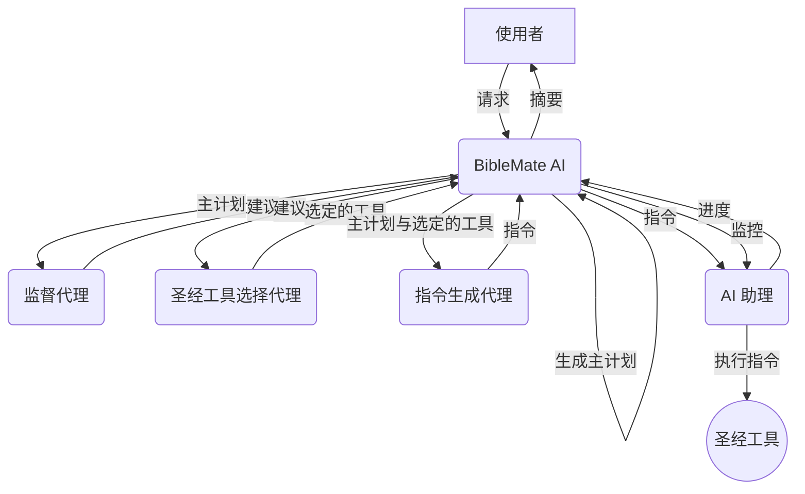

# BibleMate AI (繁体中文)

**BibleMate AI** 是一款突破性的自主 AI 代理，旨在彻底改变您的圣经学习方式。它可以创建学习计划、协调多种圣经工具，并采取多步骤行动来完成复杂的圣经相关任务，例如对特定圣经段落进行深入研究。

开发者：Eliran Wong


## 其他语言版本

英文版： https://github.com/eliranwong/biblemate

繁体中文版： https://github.com/eliranwong/biblematetc

## 👀 总览

英文：

[](https://youtu.be/BxpLmpCm4QU)

普通话：

[](https://youtu.be/BL8HXBFqmvE)

广东话：

[](https://youtu.be/MmRR3uMQPd8)

## ✨ 核心功能

- **自主 AI 代理：** BibleMate AI 可以独立工作，以满足您的圣经学习请求。
- **多步骤任务执行：** 它可以将复杂的任务分解为更小、可管理的步骤，并按顺序执行。
- **丰富的工具集：** 内建超过 40 种圣经工具，由我们全面的圣经套件 [UniqueBible App](https://github.com/eliranwong/UniqueBible) 提供支援。
- **可自订与扩充：** 进阶使用者可以自订现有工具或添加新工具，以满足其特定需求。
- **灵活的 AI 后端：** 透过 [AgentMake AI](https://github.com/eliranwong/agentmake) 支援多种 AI 后端。

## 🖥️ 支援平台

- Windows
- macOS
- Linux
- ChromeOS
- Android (透过 Piexel Terminal / Termux)

### 支援的 Python 版本

- 3.10
- 3.11
- 3.12

## 🧠 支援的 AI 后端

由 AgentMake AI 驱动，BibleMate AI 为使用者提供了使用各种 AI 后端的灵活性。更多资讯请参阅：https://github.com/eliranwong/agentmake#supported-backends

为了比较，我们在以下测试中使用了相同的提示 `深入研究耶利米哀歌 3:22-24` 来测试一些支援的后端：

BibleMate AI + `Azure + ChatGPT 5` https://youtu.be/QvPIyHOhrP0

BibleMate AI + `Gemini API + Gemini 2.5 Flash` https://youtu.be/AZ-zEl_StC0

BibleMate AI + `Mistral Large` https://youtu.be/7sBfj2TMoOE

BibleMate AI + `DeepSeek 3.1` https://youtu.be/FUr--ULDCZM

BibleMate AI + `Groq + GPT-OSS 120B` https://youtu.be/7sBfj2TMoOE

BibleMate AI + `Groq + Llama 3.3 70B` https://youtu.be/oKQyIEnMM8M

BibleMate AI + `XAI + Grok 4` https://youtu.be/JgcxciOc_Ys

### 后端设定范例

更多详情请参阅 https://github.com/eliranwong/biblematesc/tree/main/docs/backends_setup。

### 提示

为了快速上手，我们建议从 `googleai` 后端开始，该后端已与 BibleMate AI 进行了广泛测试。您可以免费获取 Gemini API 金钥。更多资讯请访问：[https://github.com/eliranwong/biblematesc/blob/main/docs/backends_setup/googleai.md](https://github.com/eliranwong/biblematesc/blob/main/docs/backends_setup/googleai.md)。

## 🎬 示范 - 代理模式

[](https://youtu.be/QvPIyHOhrP0)

另一个范例：[深入研究启示录第 7 章](https://github.com/eliranwong/biblematesc/blob/main/test/In-depth_study_on_Revelation_7.md)

## 🧩 代理工作流程

1.  **BibleMate AI** 接收使用者的请求。
2.  **BibleMate AI** 分析请求并确定需要多个步骤才能完成。
3.  **BibleMate AI** 生成一个 `主计划`，概述完成请求所需的步骤。
4.  **BibleMate AI** 将 `主计划` 发送给监督代理，后者审查提示并提供改进建议。
5.  **BibleMate AI** 将建议发送给圣经工具选择代理，后者为 `主计划` 的每个步骤选择最合适的圣经工具。
6.  **BibleMate AI** 将选定的圣经工具和 `主计划` 发送给指令生成代理，后者将建议转换为清晰简洁的指令，供 AI 助理遵循。
7.  **BibleMate AI** 将指令发送给 AI 助理，后者使用选定的圣经工具执行指令。
8.  **BibleMate AI** 监控 AI 助理的进度，并根据需要提供额外的建议或指令。
9.  所有步骤完成后，**BibleMate AI** 向使用者提供结果的简洁摘要。
10. 使用者收到最终回应，完全解决其原始请求。

### 工作流程图



## 🚀 快速入门

> pip install --upgrade biblematesc

> biblematesc

或

> bmtc

在 BibleMate AI 提示中输入您的请求。

- 按 `Ctrl+S` 提交您的请求。
- 按 `Ctrl+Y` 显示帮助资讯。

### 设定虚拟环境

例如：

```
cd
python3 -m venv biblematesc
source biblematesc/bin/activate
pip install --upgrade biblematesc
export PATH=$PATH:$HOME/biblematesc/bin
biblematesc
```

### Android 使用者

如果您发现预设的 `stdio` 传输在 Pixel Terminal 或 Termux 终端应用程式上无法正常工作，请使用以下解决方法：

解决方法：在两个不同的标签页或会话中运行内建的 MCP 伺服器和 MCP 客户端。

在一个会话中运行内建的 BibleMate AI MCP 伺服器：

> biblematescmcp

在另一个会话中运行 BibleMate AI 介面：

> biblematesc -mcp biblematesc

### 支援使用 Vertex AI

执行：

> pip install --upgrade "biblematesc[genai]"

### 升级

再次执行：

> pip install --upgrade biblematesc

### 开发者

> pip install -e .

## ⚙️ 设定 AI 后端

启动 BibleMate AI 后，输入：

> .backend

将会开启一个文字编辑器，供您编辑 AgentMake AI 设定。将 `DEFAULT_AI_BACKEND` 更改为您自己选择的 AI 后端，并在适当的地方输入 API 金钥。

您可以使用 CLI 选项 `-b` 或 `--backend` 暂时覆写预设的 AI 后端。例如，

> biblematesc -b groq

### 设定 UBA API [可选]

您可以选择性地透过编辑以下项目来设定 UBA API 后端：

```
# 工具：UBA API
UBA_API_LOCAL_PORT=8080
UBA_API_ENDPOINT="https://bible.gospelchurch.uk/plain"
UBA_API_TIMEOUT=10
UBA_API_PRIVATE_KEY=
```

### 设定远端 MCP 伺服器验证 [可选]

您可以选择性地透过编辑以下项目来设定远端 MCP 伺服器的验证资讯：

```
# BibleMate AI
BIBLEMATE_STATIC_TOKEN=
BIBLEMATE_MCP_PUBLIC_KEY=
BIBLEMATE_MCP_PRIVATE_KEY=
BIBLEMATE_MCP_ISSUER=
BIBLEMATE_MCP_AUDIENCE=
```

## 🗣️ AI 模式

您可以在三种 AI 模式之间进行选择，以适应您的偏好：

*   **聊天模式** – 提供直接的文字回应，不使用工具，非常适合简单的查询。
*   **代理模式** – 一个完全自主的代理，旨在规划、协调工具并采取多个行动来处理使用者请求。
*   **伙伴模式** – 一种半自动模式，让您参与审查和编辑提示的过程，从而对 AI 的行动有更多的控制。

新安装时，`伙伴模式` 为预设模式。

要在模式之间切换，请在 BibleMate AI 提示中使用 `.mode` 命令。这将打开一个选择对话框，您可以在其中选择您偏好的模式。


为了帮助使用者了解当前的 AI 模式，输入框的边框颜色会在切换模式时发生变化。


您可以在 `config.py` 中自订代理模式和伙伴模式的边框颜色，方法是更改 `color_agent_mode` 和 `color_partner_mode` 的值。

## 📚 内建工具与计划

### 内建工具

要查看内建工具及其描述的完整列表，请参阅 [TOOLS.md](TOOLS.md) 文件。

要启用或停用某些工具，请在 BibleMate AI 提示中输入 `.tools`。

启用 `代理模式` 后，所有已启用的内建工具都会被考虑并自动为完成使用者请求的每个步骤选择。

### 内建计划

内建计划是预定义的、经常使用的「主计划」，使用者可以快速存取。目前，我们添加了两个内建计划作为示范。使用者可以透过[自订](https://github.com/eliranwong/biblemate#customization)添加自己的计划。

以正斜线 `/` 开始您的提示以呼叫计划，例如：

> /simple_bible_study John 3:16

> /bible_devotion Deut 6:4

## 🛠️ 单一工具选择

在某些情况下，您可能希望为简单的任务指定一个特定的工具，而不是在完全自动的 `代理模式` 中自动选择多个工具。

您可以在提示的开头使用 `@` 前缀一个工具名称来指定单一工具。例如，

```
@retrieve_bible_cross_references Deut 6:4; John 3:16
```

观看此影片：https://youtu.be/50m1KRj6uhs

BibleMate AI 也可以自动选择单一工具来处理您的请求。只需在您的请求开头输入 `@` 后跟一个空格，而不是指定工具名称。例如，

```
@ Read Deut 6:4; John 3:16
```

## 📝 自订主计划

在某些情况下，您可能希望为复杂的任务指定一个包含多个工具用于不同步骤的 `自订计划`，而不是在完全自动的代理模式下自动生成 `主计划`。

您可以使用自己的自订「主计划」，而不是由 BibleMate AI 生成的计划。为此，请在您的 BibleMate AI 提示开头输入 `@@`，后跟您自己的圣经学习主计划。

例如，

```
@@ 使用以下步骤分析约翰福音 3:16：
1. 呼叫工具 'retrieve_english_bible_verses' 获取圣经文本，
2. 呼叫工具 'retrieve_bible_cross_references' 获取圣经交叉引用，
3. 呼叫工具 'interpret_new_testament_verse' 进行解释，以及
4. 呼叫工具 'write_bible_theology' 解释其神学。
```

观看此影片：https://youtu.be/Lejq0sAx030

另一个范例：

```
@@ 使用以下步骤撰写关于申命记 6:4 的感人灵修：
1. 使用 @study_old_testament_themes 分析主题
2. 使用 @identify_bible_keywords 识别并解释经文中的关键圣经关键词
3. 使用 @write_bible_insights 为灵修撰写见解
4. 使用 @write_bible_applications 将经文与日常生活联系起来
5. 使用 @write_bible_devotion 撰写一篇感人的灵修。
确保每个步骤都得到明确处理，并且最终输出具有凝聚力和启发性
```

观看此影片：https://youtu.be/NYPyujFG09E

即使您正在使用「聊天」模式并停用了「代理」模式，「@@」技巧也有效。

## 🏃 操作选单

| 命令                  | 描述                               |
|----------------------|------------------------------------|
| `.new`               | 新对话                              |
| `.exit`              | 退出 BibleMate AI                  |
| `.backend`           | 更改后端                            |
| `.mode`              | 更改 AI 模式                        |
| `.tools`             | 列出可用工具                         |
| `.plans`             | 列出可用计划                         |
| `.resources`         | 列出可用资源                         |
| `.editprompt`        | 编辑当前提示                         |
| `.backup`            | 备份对话                            |
| `.reload`            | 重新载入当前对话                     |
| `.edit`              | 编辑当前对话                        |
| `.trim`              | 修剪当前对话                        |
| `.import`            | 汇入对话                           |
| `.export`            | 汇出对话                           |
| `.find`              | 搜寻对话                           |
| `.content`           | 显示当前目录内容                    |
| `.open`              | 开启档案或目录                      |
| `.ideas`             | 生成想法                           |
| `.autosuggest`       | 切换自动输入建议                   |
| `.autoprompt`        | 切换自动提示工程                   |
| `.light`             | 切换轻量上下文                     |
| `.steps`             | 设定最大步骤数                     |
| `.matches`           | 设定最大语意匹配数                 |
| `.download`          | 下载资料档案                       |
| `.help`              | 显示帮助页面                       |

一些命令设计用于从 UniqueBible App 检索内容：

| 命令                 | 描述                               |
|----------------------|------------------------------------|
| `.bible`             | 开启圣经经文                       |
| `.chapter`           | 开启圣经章节                       |
| `.compare`           | 比较圣经经文                       |
| `.comparechapter`    | 比较圣经章节                       |
| `.chronology`        | 开启圣经年代表                     |
| `.commentary`        | 开启注释                           |
| `.aicommentary`      | 开启 AI 注释                       |
| `.index`             | 开启经文研究索引                   |
| `.translation`       | 开启逐字翻译和译本                 |
| `.discourse`         | 开启语篇分析                       |
| `.morphology`        | 开启形态学资料                     |
| `.xref`              | 开启交叉引用                       |
| `.treasury`          | 开启 TSKE                          |
| `.search`            | 搜寻圣经                           |
| `.parallel`          | 搜寻圣经平行经文                   |
| `.promise`           | 搜寻圣经应许                       |
| `.dictionary`        | 搜寻词典                           |
| `.encyclopedia`      | 搜寻百科全书                       |
| `.lexicon`           | 搜寻词典                           |
| `.topic`             | 搜寻圣经主题                       |
| `.name`              | 搜寻圣经名称                       |
| `.character`         | 搜寻圣经人物                       |
| `.locations`         | 搜寻圣经地点                       |

快速键 `Ctrl+B`、`Ctrl+C`、`Ctrl+V` 和 `Ctrl+X` 设计用于在 BibleMate AI 中开启 UBA 内容 [[阅读](https://github.com/eliranwong/biblemate#%EF%B8%8F-keyboard-shortcuts)]。

### 备注：

*   使用 `.light` 启用或停用*轻量上下文*。启用*轻量上下文*（预设）时，BibleMate 运行速度稍快，工具回应品质略有折衷。停用*轻量上下文*时，使用完整上下文，这会消耗更多权杖进行处理，但提供更高的回应品质。
*   要使用 `.import`，您需要指定一个包含已储存对话的 python 档案。每次执行备份时，对话都会储存到一个档案中。检查讯息 `Conversation backup saved to ...` 或在 `~/agentmake/computemate` 中找到备份。除了载入单纯的对话，您还可以同时载入对话及其主计划。为此，请指定一个包含 `conversation.py` 和 `master_plan.md` 的备份目录路径。
*   要使用 `.open`，您需要指定要开启的档案或目录。
*   `.edit` 命令允许您使用我们的内建文字编辑器编辑当前对话。您可以自订使用您喜欢的文字编辑器。输入 `.backend` 并使用呼叫您喜欢的文字编辑器的命令更改 `DEFAULT_TEXT_EDITOR` 的值。
*   使用 `.autosuggest` 切换自动输入建议。如果停用，您可以使用 `TAB` 键开启输入建议选单。
*   使用 `.reload` 重新载入上次储存的对话（如果有的话）。这对于在对话因任何原因中断后继续未完成的代理流程很有用。
*   命令 `.matches` 仅适用于本地 MCP 连接。它不适用于远端 MCP 连接，因为本地设定的更改不会影响远端伺服器中的设定。
*   当 `.` 后面的内容与上面列出的操作命令不匹配时，以 `.` 开始您的请求以直接检索圣经经文或章节，或执行圣经搜寻。例如：
    -   输入 `.John 3:16` 阅读约翰福音 3:16
    -   输入 `.John 3` 阅读约翰福音第 3 章
    -   输入 `.Jesus love` 执行 `Jesus love` 的圣经搜寻

## ✝️ UniqueBible 资源

我们在 BibleMate AI 中结合了两全其美的优点，以增强您的圣经学习。除了动态 AI 工具外，我们还整合了透过 BibleMate AI 提示直接存取大多数 [UniqueBible 资源](https://github.com/eliranwong/UniqueBible) 的功能。在与 AI 代理对话的任何时候，您都可以将 UniqueBible App 资料直接纳入讨论，以丰富学习流程和内容。

在 BibleMate AI 提示中输入 `.resources` 以查看可用资源。可用 UniqueBible 资源的数量取决于您在后端设定中配置的 [UniqueBible 网页伺服器](https://github.com/eliranwong/UniqueBible)。预设情况下，BibleMate AI 使用在 https://bible.gospelchurch.uk 运行的 UniqueBible 网页伺服器。UniqueBible 伺服器是高度可自订的；您可以设定一个带有自订资源的本地伺服器与 BibleMate AI 一起使用。

要将 BibleMate AI 与您的本地伺服器连接，请在 BibleMate AI 提示中输入 `.backend`，找到下面的会话，并填写您的本地伺服器详细资讯：

```
# 工具：UBA API
UBA_API_LOCAL_PORT=8080
UBA_API_ENDPOINT="http://127.0.0.1:8080/plain"
UBA_API_TIMEOUT=10
UBA_API_PRIVATE_KEY=
```

提示：以 `//` 开始您的提示以从输入建议中查看可用资源。

## 🔎 语意搜寻 [可选]

要启用语意搜寻，您需要两件事：

1.  安装 Ollama - BibleMate AI 使用 `Ollama` 为语意搜寻生成嵌入。您可以在 https://ollama.com/ 找到说明。
2.  下载一些资料档案。在 BibleMate AI 提示中输入 `.download` 并按照弹出对话框下载它们。


您也可以手动下载档案，解压缩它们，并将它们放在 `~/agentmake/biblemate/data` 目录中，其中 `~` 代表使用者的主目录：

[bible.db](https://drive.google.com/file/d/1E6pDKfjUMhmMWjjazrg5ZcpH1RBD8qgW/view?usp=sharing)

范例：

> @search_the_whole_bible God create

> //john/KJV/Jesus love

[collection.db](https://drive.google.com/file/d/1y4txzRzXTBty0aYfFgkWfz5qlHERrA17/view?usp=sharing)

范例：

> //promise/hope

> //parallel/baptism

[dictionary.db](https://drive.google.com/file/d/1UxDKGEQa7UEIJ6Ggknx13Yt8XNvo3Ld3/view?usp=sharing)

范例：

> //dictionary/Israel

[encyclopedia.db](https://drive.google.com/file/d/1NLUBepvFd9UDxoGQyQ-IohmySjjeis2-/view?usp=sharing)

范例：

> //encyclopedia/Jesus

> //encyclopedia/ISB/Jesus

[exlb.db](https://drive.google.com/file/d/1Hpo6iLSh5KzgR6IZ-c7KuML--A3nmP1-/view?usp=sharing)

范例：

> //topic/hope

> //name/Bethleham

> //character/Samuel

> //location/Jerusalem

## ⌨️ 键盘快捷键

BibleMate AI 提示栏位支援以下快速键：

- `Ctrl+Y`：帮助资讯
- `Ctrl+S` 或 `Esc+ENTER` 或 `Alt+ENTER`：提交输入
- `Ctrl+N`：新对话
- `Esc+I`：汇入对话
- `Esc+O`：编辑对话
- `Ctrl+O`：在文字编辑器中编辑输入
- `Ctrl+Q`：退出输入
- `Ctrl+R`：重设输入
- `Ctrl+Z`：复原输入变更
- `Ctrl+W`：储存提示/计划
- `Esc+W`：删除提示/计划
- `Ctrl+L`：开启提示/计划
- `Esc+L`：搜寻提示/计划
- `Ctrl+B`：开启圣经相关功能
- `Ctrl+C`：开启圣经注释
- `Ctrl+V`：开启圣经经文功能
- `Ctrl+X`：开启交叉引用功能
- `Ctrl+F`：开启搜寻功能
- `Ctrl+J`：更改 AI 模式
- `Ctrl+G`：切换自动输入建议
- `Esc+G`：生成可尝试的提示想法
- `Ctrl+P`：切换自动提示工程
- `Esc+P`：改进提示内容
- `Ctrl+D`：删除
- `Ctrl+H`：退格
- `Ctrl+W`：删除前一个单词
- `Ctrl+U`：删除到行首的文字
- `Ctrl+K`：删除到行尾的文字
- `Ctrl+A`：移至行首
- `Ctrl+E`：移至行尾
- `Ctrl+LEFT`：向左移动一个单词
- `Ctrl+RIGHT`：向右移动一个单词
- `Ctrl+UP`：向上卷动
- `Ctrl+DOWN`：向下卷动
- `Shift+TAB`：插入四个空格
- `TAB` 或 `Ctrl+I`：开启输入建议选单
- `Esc+Esc`：关闭输入建议选单

### 取消载入 AI 回应

在等待回应时，按 `Ctrl+C` 一次或两次，直到载入被取消。

### 终端机应用程式的通用快捷键：

- `Ctrl+Shift+C`：复制
- `Ctrl+Shift+V`：贴上

## ✒️ 内建文字编辑器


您可以使用我们的内建文字编辑器编辑当前提示，方法是在 BibleMate AI 提示栏位中输入 `.editprompt` 或按 `Ctrl+O`。

您也可以透过执行 `etextedit` 单独启动内建编辑器。

您可以在我们的内建文字编辑器 `etextedit` 中使用以 BibleMate AI 和 AgentMake AI 建构的外挂程式。

外挂程式 `Extract Bible References` 和 `Insert Bible Text` 已随 BibleMate AI 一起安装。

您也可以添加自己的 `etextedit` 外挂程式并将它们放入 `~/etextedit/plugins`。

更多关于 `etextedit` 的资讯请参阅 https://github.com/eliranwong/etextedit

## 汇出为 DOCX 或 PDF [可选]

`etextedit` 提供将内容汇出为 DOCX 和 PDF 档案的选项。

-   需要 `pandoc` 才能将内容汇出为 DOCX 格式。例如，在 Debian/Ubuntu 上安装：

> sudo apt install pandoc

-   需要 `pdflatex` 才能将内容汇出为 PDF 格式。例如，在 Debian/Ubuntu 上安装：

> sudo apt install texlive-full

## 第三方文字编辑器 [可选]

您可以使用您自己选择的第三方文字编辑器。在 BibleMate AI 提示中输入 `.backend` 并使用呼叫您喜欢的文字编辑器的命令指定 `DEFAULT_TEXT_EDITOR` 的值，例如 `micro -softwrap true -wordwrap true`。要使用内建文字编辑器 `etextedit` 进行更改，您只需一个步骤，即储存 `Ctrl+S` 或退出 `Ctrl+Q`，即可返回 BibleMate AI 提示。但是，使用第三方文字编辑器，您需要在退出前先储存更改。

## 🛠️ 自订

BibleMate AI 是高度可自订的。进阶使用者可以修改现有工具、创建新工具，甚至可以透过自订系统提示来更改 AI 代理的行为。

自订档案放置在 AgentMake 使用者目录中的 `biblemate` 子目录中（在 Linux/macOS 上通常是 `~/.agentmake/biblemate`，在 Windows 上是 `%USERPROFILE%\.agentmake\biblemate`）。

### 常用提示与计划

您可以储存、搜寻、开启或删除常用的提示和计划。

例如：

*   输入提示并使用 `Ctrl+W` 储存提示。
*   在提示前加上 `@@` 并使用 `Ctrl+W` 储存提示。
*   使用 `Esc+W` 删除已储存的提示/计划。
*   使用 `Ctrl+L` 开启提示/计划。
*   使用 `Esc+L` 搜寻提示/计划。

### 覆写系统提示

代理的核心逻辑由系统提示（markdown 档案）指导。您可以透过将您自己的版本放置在 `~/.agentmake/systems/biblemate/` 中来覆写它们。

可自订的系统提示档案是：`supervisor.md`、`tool_instruction.md` 和 `tool_selection.md`。您可以将它们从套件安装资料夹中的 `biblemate/systems` 目录复制到您的使用者目录并根据需要进行修改。

### 新增或修改工具与计划

您可以透过创建自订的 `bible_study_mcp.py` 档案来添加您自己的工具和内建计划（提示）。

1.  首先，在 `biblemate` 套件安装目录中找到内建的 `bible_study_mcp.py` 档案。
2.  将此档案复制到您的使用者自订目录 `~/.agentmake/biblemate/bible_study_mcp.py`。
3.  现在您可以编辑此档案以使用 `fastmcp` 语法添加或修改工具和提示。BibleMate AI 将自动载入您的自订档案而不是内建档案。

### 使用 http 作为传输方式而非 stdio

BibleMate 使用 `stdio` 作为与 BibleMate MCP 伺服器互动的预设传输方式。您可以使用 `http` 代替。

在一个执行绪中运行：

> biblematemcp

在另一个执行绪中运行：

> biblemate -mcp biblemate

### 使用本地圣经资料

更多详情请参阅[此处](https://github.com/eliranwong/biblematesc/issues/15#issuecomment-3314130281)。

### 使用自订 MCP 伺服器

您可以透过 CLI 选项 `mcp` 使用自订 MCP 伺服器，例如：

> biblemate -mcp http://127.0.0.1:33333/mcp

### 托管或执行 BibleMate MCP 伺服器

使用预设埠 `33333`：

> biblematemcp

可以在设定档 `config.py` 中编辑预设埠。

要暂时覆写预设埠，例如：

> biblematemcp -p 33334

## 📖 教学

... （即将推出） ...

## 📄 授权

本专案根据创用 CC 姓名标示-非商业性 4.0 国际授权条款进行授权 - 详情请参阅 [LICENSE](LICENSE) 档案。

## 🙏 致谢

BibleMate AI 建立在我们其他专案的基础之上：
*   [UniqueBible App](https.github.com/eliranwong/UniqueBible)
*   [ComputeMate AI](https.github.com/eliranwong/computemate)
*   [AgentMake AI](https.github.com/eliranwong/agentmake)
*   [AgentMake AI MCP](https.github.com/eliranwong/agentmakemcp)
