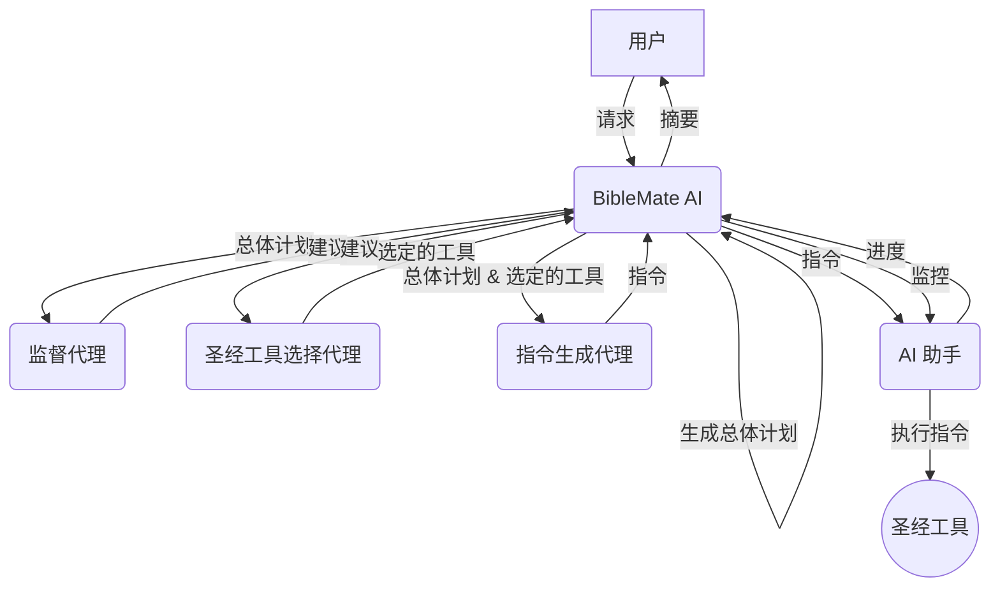

# BibleMate AI

**BibleMate AI** 是一款开创性的自主 AI 代理，旨在彻底改变您的圣经学习方式。它可以创建学习计划，协调多种圣经工具，并采取多步骤行动来完成复杂的圣经相关任务，例如对特定圣经段落进行深入研究。

网站：https://biblemate.ai

开发者：Eliran Wong

https://youtu.be/BxpLmpCm4QU

## 其他语言

英文版：https://github.com/eliranwong/biblemate

简体中文版：https://github.com/eliranwong/biblematesc

## 👀 总览

英语：https://youtu.be/L3EY1iDx8lQ

普通话：https://youtu.be/BL8HXBFqmvE

粤语：https://youtu.be/MmRR3uMQPd8

## ✨ 核心功能

- **自主 AI 代理：** BibleMate AI 可以独立工作以满足您的圣经学习请求。
- **多步骤任务执行：** 它可以将复杂的任务分解为更小、更易于管理的步骤，并按顺序执行。
- **丰富的工具集：** 内置超过 100 种圣经工具，由我们全面的圣经套件 [UniqueBible App](https://github.com/eliranwong/UniqueBible) 提供支持。
- **可定制和可扩展：** 高级用户可以自定义现有工具或添加新工具以满足其特定需求。
- **灵活的 AI 后端：** 通过 [AgentMake AI](https://github.com/eliranwong/agentmake) 支持多种 AI 后端。

## 🖥️ 支援平台

- Windows
- macOS
- Linux
- ChromeOS
- Android (透过 Piexel Terminal / Termux)

### 支援的 Python 版本

- 3.10
- 3.11
- 3.12

## 🧩 代理工作流程

1.  **BibleMate AI** 接收来自用户的请求。
2.  **BibleMate AI** 分析请求并确定需要多个步骤才能完成。
3.  **BibleMate AI** 生成一个`总体计划`，概述完成请求所需的步骤。
4.  **BibleMate AI** 将`总体计划`发送给监督代理，后者审查提示并提供改进建议。
5.  **BibleMate AI** 将建议发送给圣经工具选择代理，后者为`总体计划`的每个步骤选择最合适的圣经工具。
6.  **BibleMate AI** 将选定的圣经工具和`总体计划`发送给指令生成代理，后者将建议转换为清晰简洁的指令，供 AI 助手遵循。
7.  **BibleMate AI** 将指令发送给 AI 助手，后者使用选定的圣经工具执行指令。
8.  **BibleMate AI** 监控 AI 助手的进度，并根据需要提供额外的建议或指令。
9.  所有步骤完成后，**BibleMate AI** 会向用户提供结果的简洁摘要。
10. 用户收到最终响应，完全解决了他们最初的请求。

### 工作流程图

## 🚀 快速入门

请在 https://github.com/eliranwong/biblematesc/blob/main/docs/installation/macOS.md 阅读最新的安装说明

> pip install --upgrade biblematesc

要运行 BibleMate AI：

> biblematesc

或

> bmtc

在 BibleMate AI 提示符中输入您的请求。

- 按 `Ctrl+S` 提交您的请求。
- 按 `Ctrl+Y` 显示帮助信息。
- 按 `Ctrl+Q` 退出 BibleMate AI 提示符。

## 🗣️ AI 模式

您可以根据自己的喜好在三种 AI 模式之间进行选择：

*   **聊天模式** – 提供直接的文本响应，不使用工具，非常适合简单的查询。
*   **代理模式** – 一个完全自主的代理，旨在规划、协调工具并采取多个行动来处理用户请求。
*   **伙伴模式** – 一种半自动模式，让您通过审查和编辑提示参与流程，从而更好地控制 AI 的行为。

`伙伴模式`在新安装时设置为默认模式。

要切换模式，请在 BibleMate AI 提示符中使用 `.mode` 命令。这将打开一个选择对话框，您可以在其中选择您喜欢的模式。

为了帮助用户了解当前的 AI 模式，输入边框的颜色会随著模式的切换而改变。

## 📖 教学

* 🔌 [可选设置](https://github.com/eliranwong/biblematesc/blob/main/docs/installation/additional_setup.md)
* ⚙️ [配置 AI 后端](https://github.com/eliranwong/biblematesc/blob/main/docs/backends_setup/README.md)
* 🏃 [操作菜单](https://github.com/eliranwong/biblematesc/blob/main/docs/tutorials/Action_Menu.md)
* ⌨️ [键盘快捷键](https://github.com/eliranwong/biblematesc/blob/main/docs/tutorials/Key_Bindings.md)
* 🏷️ [特殊输入前缀](https://github.com/eliranwong/biblematesc/blob/main/docs/tutorials/Special_Entry_Prefixes.md)
* 📚 [内置工具和计划](https://github.com/eliranwong/biblematesc/blob/main/docs/tutorials/Built-in_Tools_Plans.md)
* 📝 [自定义总体计划](https://github.com/eliranwong/biblematesc/blob/main/docs/tutorials/Custom_Master_Plan.md)
* 🔧 [单一工具选择](https://github.com/eliranwong/biblematesc/blob/main/docs/tutorials/Single_Tool_Selection.md)
* ✝️ [UniqueBible 资源](https://github.com/eliranwong/biblematesc/blob/main/docs/tutorials/UniqueBible_Resources.md)
* 🔎 [语义搜索](https://github.com/eliranwong/biblematesc/blob/main/docs/tutorials/Semantic_Searches.md)
* ✒️ [文本编辑器](https://github.com/eliranwong/biblematesc/blob/main/docs/tutorials/Text_Editor.md)
* 🛠️ [自定义](https://github.com/eliranwong/biblematesc/blob/main/docs/tutorials/Customization.md)

## 📄 许可证

本项目根据知识共享署名-非商业性 4.0 国际许可证进行许可 - 有关详细信息，请参阅 [LICENSE](LICENSE) 文件。

## 🙏 致谢

BibleMate AI 建立在我们其他项目的基础之上：
*   [UniqueBible App](https.github.com/eliranwong/UniqueBible)
*   [ComputeMate AI](https.github.com/eliranwong/computemate)
*   [AgentMake AI](https.github.com/eliranwong/agentmake)
*   [AgentMake AI MCP](https.github.com/eliranwong/agentmakemcp)
